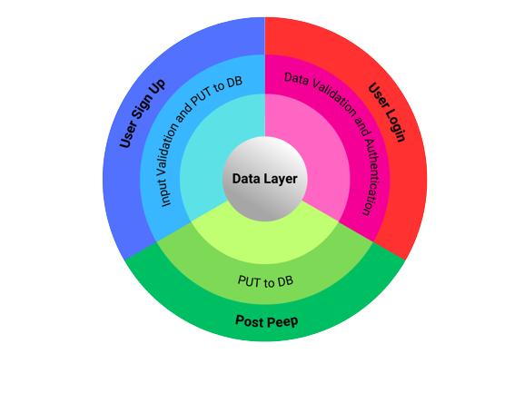
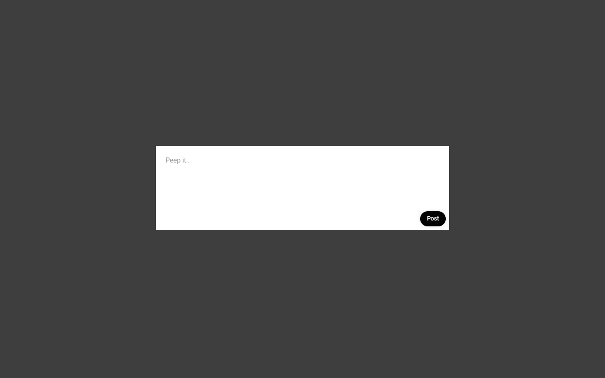

## Challenge:

As usual please start by forking this repo.

We are going to write a small twitter clone that will allow users to post messages to a public wall.

Good luck and let the chitter begin!

### Setup

1. Fork and clone this repository to your local machine.

##### Front End

2. `cd ChitterFrontEnd`into the front end folder and run `npm i`
3. Run `npm run dev` to start the server.

##### Back End

4. `cd` into the top directory with`../`
5. . `cd ChitterBackEnd` into the backend folder and run `npm i`
6. Run `npm start` or `npm run start-win` (on windows) to start the server.
7. To run tests the command is `npm run test`
8. To run coverage the command is `npm run coverage`

### User Story 1

As a trainee software engineer
So that I can let people know what I am doing  
I want to **post** a **_message (peep)_** to chitter

_Peeps (posts to chitter) have the name of the trainee and their user handle._

### ToDo 1

- [ ] UI input.
- [ ] Peeps should have a time properties for when they were created.
- [ ] Peeps will be added to a database (Or array initially).

### Domain Model 1

```
| Objects      | Properties    | Messages    | Outputs |
| ------------ | ------------- | ----------- | ------- |
| peep         | Peep(@Object) | sendPeep()  |         |

```

### Tests 1

- [ ] 1. Check that the input for the peep is correct.
- [ ] 2. Check that the peep is sent to the database correctly.
- [ ] 3. Check that an error is returned if the peep is null or empty.

### User Story 2

As a trainee
So that I can see what others are saying  
I want to **see** **_all peeps_**

### Domain Model 2

```
| Objects | Properties             | Messages        | Outputs                       |
| ------- | ---------------------- | --------------- | ----------------------------- |
| peep    | Peeps(@Array[@Object]) | getAllPeeps()   | Peeps(@Name, @Message, @Date) |
```

### Tests 2

- [ ] 1. Check that the peep is retrieved from the database correctly.
- [ ] 3. Check that an error is returned if the peep is not retrieved correctly

### User Story 3

As a trainee
So that I can see what others are saying  
I want **_all peeps_** to be displayed in **reverse chronological** order

### ToDo 3

- [ ] Peeps should be sorted so that they are displayed with the most recent first to oldest last.

### Domain Model 3

```
| Objects | Properties             | Messages    | Outputs                       |
| ------- | ---------------------- | ----------- | ----------------------------- |
| Peeps   | Peeps(@Array[@Object]) | sortPeeps() | Peeps(@Name, @Message, @Date) |
```

### Tests 3

- [ ] 1. Check that peeps are displayed in the correct order.

### User Story 4

As a trainee
So that I can better appreciate the context of a peep
I want to **see** the **_time_** at which it was made

### ToDo 4

- [ ] Display the created time property on the react component for a peep.

### Domain Model 4

```
| Objects | Properties    | Messages | Outputs                      |
| ------- | ------------- | -------- | ---------------------------- |
| Peep    | Peep(@Object) |          | Peep(@Name, @Message, @Date) |
```

### Tests 4

- [ ] 1. Check that the correct date + time is displayed on a single peep.

### User Story 5

As a trainee
So that I can post messages on Chitter as me
I want to **sign up** for **_Chitter_**

### Domain Model 5

```
| Objects | Properties        | Messages        | Outputs |
| ------- | ----------------- | --------------- | ------- |
| User    | userInfo(@Object) | sendUser(@User) |         |
```

### User Story 6

As a trainee
So that only I can post messages on Chitter as me
I want to **log in** to **_Chitter_**

### ToDo 6

- [ ] Submit login form data.
- [ ] Compare that data to the stored data in the database: search for the email for a match, then check the password is correct.
- [ ] Login should be a state

### Domain Model 6

```
| Objects   | Properties         | Messages        | Outputs              |
| --------- | ------------------ | --------------- | -------------------- |
| userLogin | loginInfo(@Object) | findUser(@User) | userExists(@boolean) |
```

### Tests 6

- [ ] 1. Check that the user email is correctly formatted.
- [ ] 2. Check that the password is correctly formatted.
- [ ] 3. Check that the email comparison works correctly.
- [ ] 4. Check that the user is logged in successfully if they have an account.
- [ ] 5. Check that an error is returned if the user doesn't not have an account.

### User Story 7

As a trainee
So that I can avoid others posting messages on Chitter as me
I want to **log out** of **_Chitter_**

- Logout should change the state thus preventing peeps from being posted.

### ToDo 7

- [ ] - Logout should change the state thus preventing peeps from being posted.

### Domain Model 7

```
| Objects  | Properties | Messages   | Outputs  |
| -------- | ---------- | ---------- | -------- |
| loggedIn | loggedIn   | logOut()   | @boolean |
```

### Tests 7

- [ ] 1. Check that the user loggedIn state is updated correctly when logging out.

## Additional requirements:

- You don't have to be logged in to see the peeps.
- Trainee software engineers sign up to chitter with their email, password, name and a username (e.g. ewright@digitalfutures.com, password123, Ed Wright, edwright6975).
- The username and email are unique.
- Peeps (posts to chitter) have the name of the trainee and their user handle.
- Your README should indicate the technologies used, and give instructions on how to install and run the tests.

### Extended Acceptance Criteria

```
As a trainee
So that I can stay constantly tapped in to the shouty box of Chitter
I want to receive an email if I am tagged in a Peep

As a trainee
In order to start a conversation as a DFA trainee Software Engineer
I want to reply to a peep from another trainee.
```

### Component Hierarchy

- Timeline Page
  - Header
  - PeepPoster
  - PeepTimeline
  - Footer
- Sign Up Page
  - Header
  - Form
    - Name
    - Email
    - Password
    - Sign Up Button
  - Footer
- Login Page
  - Header
  - Form
    - Email
    - Password
    - Login Button
  - Footer

### Routes

```
| Request            | Type | Route   | Data Response               |
| ------------------ | ---- | ------- | --------------------------- |
| Get all Peeps      | GET  | /       | JSON of all peeps           |
| Add a new Peep     | POST | /post   | JSON of new peep            |
| Sign up a new user | POST | /signup | JSON of new user            |
| Login a user       | GET  | /login  | JSON of specific users data |
```

### Schema

```
Users {
\_id: String
email: String
password: String
name: String
username: String
}

Peeps {
\_id: String
profilePicture: String
username: String
date: Date
message: String
}
```

### N-Tier Diagram



### Mock Ups




### Technologies Used

#### Frontend

1. React (Vite)
2. React Router
3. Axios
4. Formik
5. Yup
6. Dayjs
7. Tailwind
8. PostCSS
9. DaisyUI

#### Backend

1. NodeJS
2. Mongoose
3. Express
4. Mocha
5. Chai
6. Chai-http
7. Cors
8. Body Parser
9. DotEnv
10. ExpressValidator
11. MongoDB
