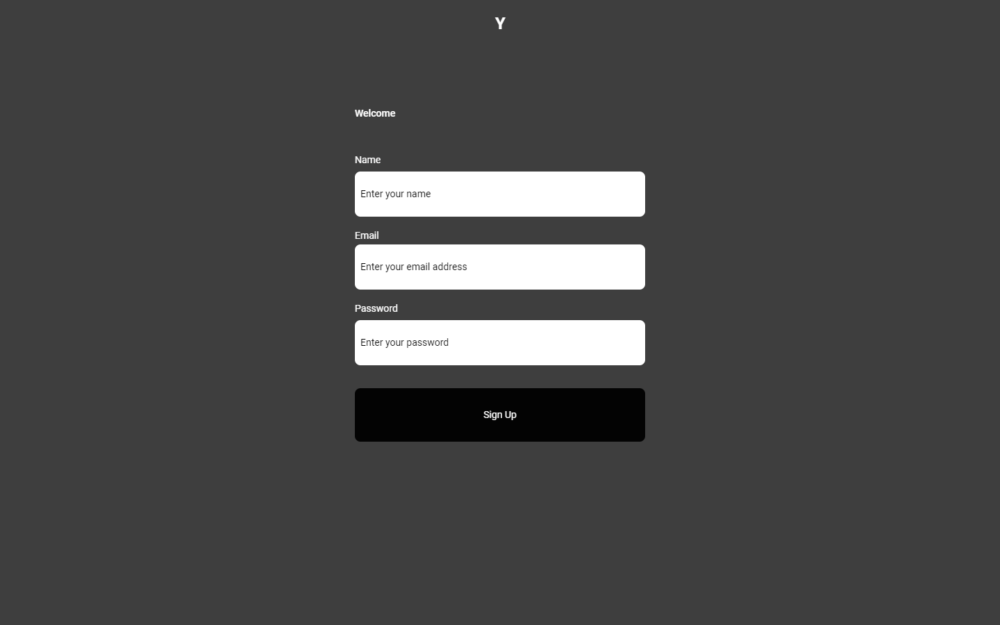
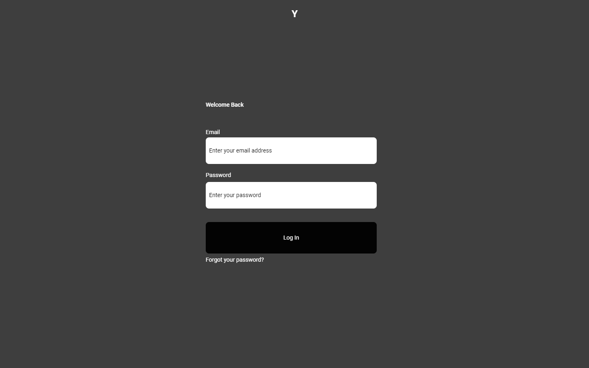
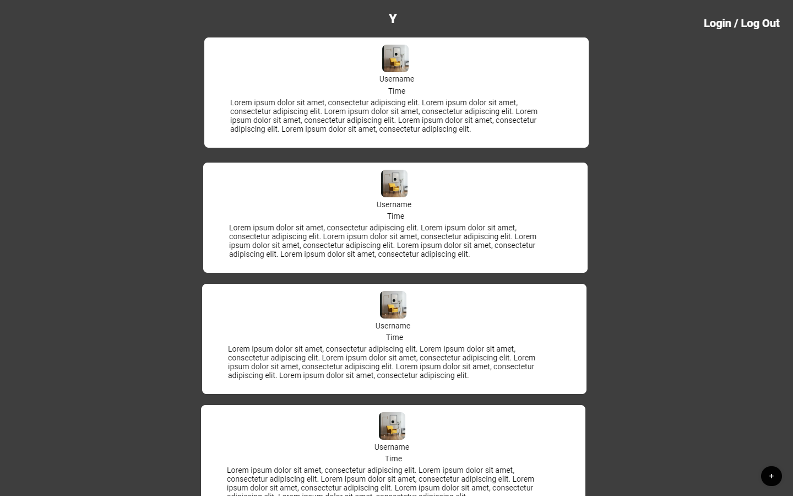

## A simple clone of Twitter/X that allows users to sign up, log in, and post tweets.

This project was my final challenge during the [Digital Futures Academy](https://digitalfutures.com) and my first full stack application. It is a relatively simple application that allows for a user to:

- **Signup**: New users can create an account to join Y.
- **Login**: Registered users can log in to access their timeline and peep (tweet).
- **Post Peeps**: Once logged in, users can share their thoughts in peep format.

## Mock Ups





## Installation and Setup

1. **Clone the repository**:

   ```bash
   git clone https://github.com/MaxB-Coder/Y.git
   cd Y
   ```

2. **Install Front End dependencies**:

   ```bash
    cd FrontEnd
    npm install
   ```

3. **Run the Front End Server**:

   ```bash
    npm run dev
   ```

4. **Install Back End dependencies**:

   ```bash
    cd ../
    cd BackEnd
    npm install
   ```

5. **Run the Backend Server**:

   ```bash
    npm start
   ```

Visit `http://localhost:3010` in your browser to access Y!

### Prerequisites

- Git
- Node.js

### Technologies

#### Frontend

- React (Vite)
- React Router
- Axios
- Formik
- Yup
- Dayjs
- Tailwind
- PostCSS
- DaisyUI

#### Backend

- Mongoose
- Express
- Mocha
- Chai
- Chai-http
- Cors
- Body Parser
- DotEnv
- ExpressValidator
- MongoDB

## API Endpoints

- `POST /sign-up`: Endpoint to register a new user.
- `POST /login`: Endpoint to log in an existing user.
- `POST /`: Endpoint to post a new peep.
- `get /`: Endpoint to get all peeps.

## Known Issues

- User is logged out after posting a peep.

## Acknowledgements

- Twitter, for the inspiration.
- Digital Futures for setting this project as a challenge.
